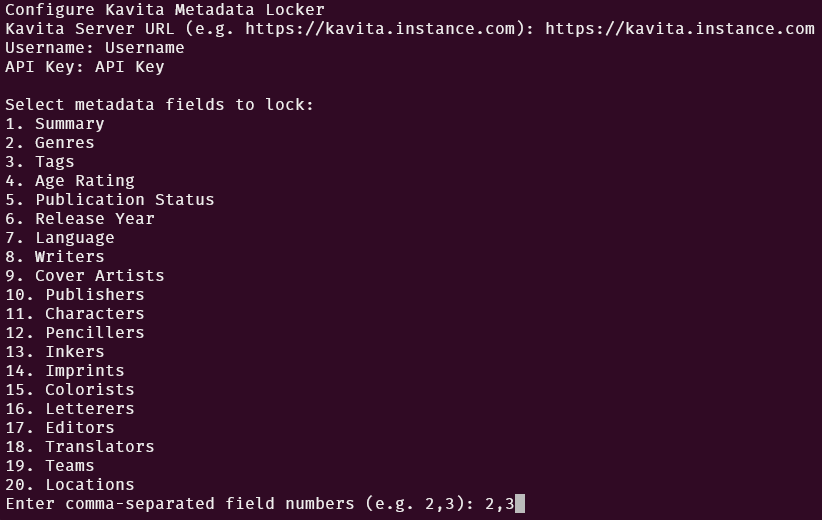
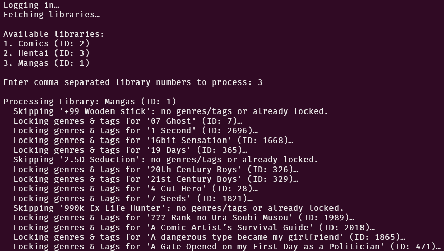

# Kavita Metadata Locker

> A Python CLI tool to lock metadata fields (e.g., genres, tags, summary) on your Kavita server for all series within selected libraries.

 

## Features

- Interactive selection of metadata fields to lock
- Select libraries to apply the lock
- Reports statistics: total series processed, locked, and skipped

## Requirements

- Python 3.12 or higher (probably works with lower versions, but not tested)
- Kavita server URL, user credentials, and valid API key

## Setup

1. Clone the repository:
    ```bash
    git clone https://github.com/Rabenherz112/kavita-metadata-locker.git
    cd kavita-metadata-locker
    ```
2. Bootstrap virtual environment:
    ```bash
    python3 setup_env.py
    ```

    - Creates a `.venv` directory with a virtual environment
    - Install / update required dependencies (`requests`)
3. Activate the virtual environment:
    ```bash
    source .venv/bin/activate
    ```

## Usage

1. Run the metadata locker:
    ```bash
    python3 kavita-metadata-locker.py
    ```
2. Follow the interactive prompts to select libraries and metadata fields to lock.
    - Kavita Server URL: `https://kavita.instance.com` or `http://localhost:5000`
    - Username: Your Kavita username
    - API Key: Your Kavita API key for the user
    - Fields to lock: Select the metadata fields you want to lock (e.g., genres, tags, summary)
    - Libraries: Select the libraries you want to apply the lock to
3. The script will print per-series actions and a final summary, for example:
    ```
    Processed 120 series: Locked 100, Skipped 20.
    ```

## Screenshots




## Why I created this

I personally use Kavita with Komf to get and manage my metadata. However since Komf can't lock currently all metadata fields, I created this tool to lock the metadata fields I want to keep. As otherwise when Kavita runs a scan, the metadata gets removed again.

## License

This project is licensed under the GNU AGPL v3.0. See the [LICENSE](./LICENSE) file for details.
